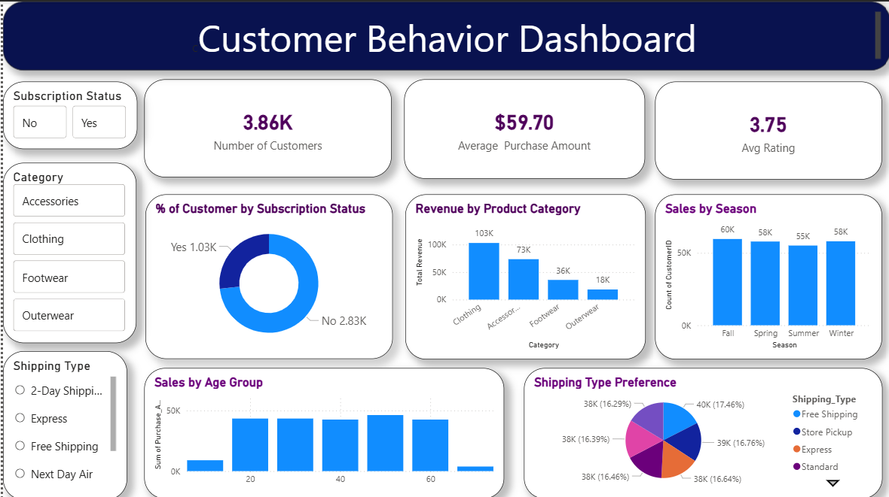

Customer Shopping Behavior & Trends Analysis

🚀 Project Overview
This project involves an end-to-end analysis of customer shopping data to identify purchasing patterns, product performance, and subscription impact. 
The goal was to answer critical business questions regarding revenue drivers, seasonal trends, and customer retention.

Using Python for data processing, SQL for complex querying, and Power BI for visualization, I analyzed over 3,900 customer records.

 📊 Key Business Insights 
- Customer Base: Analyzed behavior of 3.86K Customers with an Average Rating of 3.75.
- Revenue Driver: The "Clothing" category is the highest revenue generator (~$104K), significantly outperforming Outerwear and Footwear.
- Subscription Impact: Only ~27% (1.05K) of customers are subscribers, highlighting a major opportunity to improve loyalty programs.
- Seasonal Consistency: Surprisingly, sales remain stable across all four seasons (Fall, Spring, Summer, Winter), indicating a non-seasonal product demand.
- Shipping Preference: Shipping choices (Standard, Express, Next Day) are evenly distributed (~16-17% each), showing no single preferred delivery method.

🛠 Tech Stack & Workflow
| Tool | Purpose |
| :--- | :--- |
| Python (Pandas) | Data Cleaning, handling null values, and feature engineering (created Age Group buckets). |
| SQL (MySQL) | Executing complex queries to find high-value customers and category trends. |
| Power BI | Building the interactive dashboard with DAX measures for KPIs. |

📂 Repository Structure

Customer_behavior_Dashboard.pbix  # Interactive Power BI Report
├── Customer_behaviour.ipynb          # Python Notebook for Data Preprocessing
├── SQL_queries.sql                   # Key Business Questions Solved in SQL
├── customer_shopping_behavior.csv    # Raw Dataset (3900 rows)
├── Customer Shopping Behavior Analysis.pdf # Detailed Project Report
└── CB_Dashboard_SS.png               # Dashboard Screenshot

🧠 Solved Business Problems (SQL & Analysis)
1. Premium Customer Identification: Segmented users based on purchase amount (>$80) to target VIP marketing.
2. Age Demographics: Analyzed which age group contributes most to "Clothing" sales.
3. Satisfaction Analysis: Correlated 'Review Ratings' with 'Shipping Types' to see if faster shipping leads to better ratings.

💡 How to Use
1. Data Cleaning: Run Customer_behaviour.ipynb to see the cleaning process.
2. Analysis: Load customer_shopping_behavior.csv into your SQL database and run queries from SQL_queries.sql.
3. Visualization: Open Customer_behavior_Dashboard.pbix in Power BI Desktop to interact with the charts.

---
Created by Rani Jadhav | Data Analytics Portfolio Project
